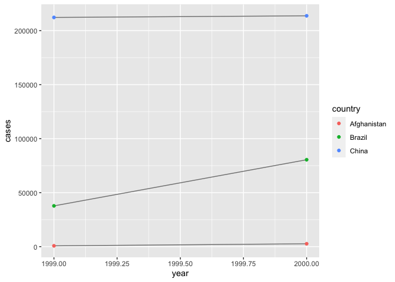

Tidying Data
================
Greg Dean
2023-01-26

This document demostrates some techniques to organize data as *tidy
data*.

Once your data is organized into a tidy form, you are able to apply the
various tools of the tidyverse to find insights in your data.

The examples in this document are adapted from Chapter 9 in the first
edition of *R for Data Science* by Hadley Wickham & Garrett Grolemund.

## Prerequisites

We will be focusing on the *tidyr* package in this example. *Tidyr*
provides a variety of tools that help “tidy up” messy (or non-tidy) data
sets.

Since *tidyr* is part of the “core tidyverse” we can load the tidyverse
package to gain the functionality we need:

    ## ── Attaching packages ─────────────────────────────────────── tidyverse 1.3.2 ──
    ## ✔ ggplot2 3.4.0      ✔ purrr   1.0.0 
    ## ✔ tibble  3.1.8      ✔ dplyr   1.0.10
    ## ✔ tidyr   1.2.1      ✔ stringr 1.5.0 
    ## ✔ readr   2.1.3      ✔ forcats 0.5.2 
    ## ── Conflicts ────────────────────────────────────────── tidyverse_conflicts() ──
    ## ✖ dplyr::filter() masks stats::filter()
    ## ✖ dplyr::lag()    masks stats::lag()

## Representation of the Same Data in Different Ways

The following example represents the same underlying data in four
different ways.

Each dataset shows the same values of four variables organized in a
different way:

1.  Country
2.  Year
3.  Population
4.  Cases

<!-- -->

    ## # A tibble: 6 × 4
    ##   country      year  cases population
    ##   <chr>       <int>  <int>      <int>
    ## 1 Afghanistan  1999    745   19987071
    ## 2 Afghanistan  2000   2666   20595360
    ## 3 Brazil       1999  37737  172006362
    ## 4 Brazil       2000  80488  174504898
    ## 5 China        1999 212258 1272915272
    ## 6 China        2000 213766 1280428583

    ## # A tibble: 12 × 4
    ##    country      year type            count
    ##    <chr>       <int> <chr>           <int>
    ##  1 Afghanistan  1999 cases             745
    ##  2 Afghanistan  1999 population   19987071
    ##  3 Afghanistan  2000 cases            2666
    ##  4 Afghanistan  2000 population   20595360
    ##  5 Brazil       1999 cases           37737
    ##  6 Brazil       1999 population  172006362
    ##  7 Brazil       2000 cases           80488
    ##  8 Brazil       2000 population  174504898
    ##  9 China        1999 cases          212258
    ## 10 China        1999 population 1272915272
    ## 11 China        2000 cases          213766
    ## 12 China        2000 population 1280428583

    ## # A tibble: 6 × 3
    ##   country      year rate             
    ## * <chr>       <int> <chr>            
    ## 1 Afghanistan  1999 745/19987071     
    ## 2 Afghanistan  2000 2666/20595360    
    ## 3 Brazil       1999 37737/172006362  
    ## 4 Brazil       2000 80488/174504898  
    ## 5 China        1999 212258/1272915272
    ## 6 China        2000 213766/1280428583

    ## # A tibble: 3 × 3
    ##   country     `1999` `2000`
    ## * <chr>        <int>  <int>
    ## 1 Afghanistan    745   2666
    ## 2 Brazil       37737  80488
    ## 3 China       212258 213766

    ## # A tibble: 3 × 3
    ##   country         `1999`     `2000`
    ## * <chr>            <int>      <int>
    ## 1 Afghanistan   19987071   20595360
    ## 2 Brazil       172006362  174504898
    ## 3 China       1272915272 1280428583

While these tables are all representations of the same underlying data,
they are not equally easy to use.

One dataset, the *Tidy Data Set* will be much easier to work with inside
the tidyverse.

## Three Rules Which Make a Data Set Tidy

\[INSERT THE PICTURE FROM PG. 149 HERE\]

1.  Each variable must have its own column.
2.  Each observation must have its own row.
3.  Each value must have its own cell.

In the example above, only `table1` is tidy, as it is the only
representation where each column is a variable.

Why ensure the data is tidy?

Two main advantages:

1.  **Consistency**. If you have a consistent data structure, it’s
    easier to learn the tools that work with it because they have an
    underlying uniformity.

2.  **Vectors**. Placing variables in columns allows R’s vectorized
    nature to shine. Most built-in functions in the R Programming
    language work with vectors of values, and tidy data works well with
    these types of functions.

<!-- -->

    ## # A tibble: 6 × 5
    ##   country      year  cases population  rate
    ##   <chr>       <int>  <int>      <int> <dbl>
    ## 1 Afghanistan  1999    745   19987071 0.373
    ## 2 Afghanistan  2000   2666   20595360 1.29 
    ## 3 Brazil       1999  37737  172006362 2.19 
    ## 4 Brazil       2000  80488  174504898 4.61 
    ## 5 China        1999 212258 1272915272 1.67 
    ## 6 China        2000 213766 1280428583 1.67

    ## # A tibble: 2 × 2
    ##    year      n
    ##   <int>  <int>
    ## 1  1999 250740
    ## 2  2000 296920

<!-- -->
